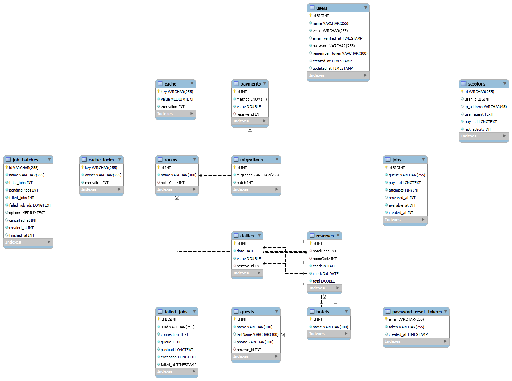

# Projeto de Teste para estagiário backend na empresa FOCO

## Tabela de Conteúdos

- [Funcionalidades](#funcionalidades)
- [Tecnologias](#tecnologias-utilizadas)
- [Configurando o Projeto](#instalação)

## Funcionalidades

1. Modelagem de Dados: A modelagem foi feita no workbench utilizando os arquivos XML como base.
2. Importação dos dados no formato XML: Foi feito o script para a importação dos dados XML e depois para ser salvo no banco de dados .
3.CRUD dos quartos por meio de API REST: O crud foi desenvolvido utilizando API REST
4.POST de reservas: Foi feito utilizando a API REST


## Tecnoloogias

- PHP(versão 8.2.12)
- Laravel Framework(versão 11.30.0)
- MYSQL (versão 8.0.34)

## DIAGRAMA ENTIDADE RELACIONAMENTO



## Configurando o Projeto
### 1.Clonar o repositorio e usar:
```
git clone https://github.com/Igor21dev/ProjetoEstagio.git
cd ProjetoEstagio
```

### 2. criar um banco de dados mysql e rodar esse script:
```
create table projeto_estagio;
use projeto_estagio;
CREATE TABLE hotels (
    id INT NOT NULL AUTO_INCREMENT,
    name VARCHAR(100) NOT NULL,
    PRIMARY KEY (id)
);
 CREATE TABLE rooms (
    id INT NOT NULL AUTO_INCREMENT,
    name VARCHAR(100) NOT NULL,
    hotelCode INT DEFAULT NULL,
    PRIMARY KEY (id),
    FOREIGN KEY (hotelCode) REFERENCES hotels(id) ON DELETE SET NULL
);

CREATE TABLE reserves (
    id INT NOT NULL AUTO_INCREMENT,
    hotelCode INT,
    roomCode INT,
    checkIn DATE NOT NULL,
    checkOut DATE NOT NULL,
    total DOUBLE NOT NULL,
    PRIMARY KEY (id),
    FOREIGN KEY (hotelCode) REFERENCES hotels(id),
    FOREIGN KEY (roomCode) REFERENCES rooms(id)
);

CREATE TABLE dailies (
    id INT NOT NULL AUTO_INCREMENT,
    date DATE NOT NULL,
    value DOUBLE NOT NULL,
    reserve_id INT DEFAULT NULL,
    PRIMARY KEY (id),
    FOREIGN KEY (reserve_id) REFERENCES reserves(id) ON DELETE CASCADE
);

CREATE TABLE guests (
    id INT NOT NULL AUTO_INCREMENT,
    name VARCHAR(100) NOT NULL,
    lastName VARCHAR(100),
    phone VARCHAR(100),
    reserve_id INT,
    PRIMARY KEY (id),
    FOREIGN KEY (reserve_id) REFERENCES reserves(id)
);

CREATE TABLE payments (
    id INT NOT NULL AUTO_INCREMENT,
    method ENUM('credit_card', 'debit_card', 'cash', 'transfer') NOT NULL,
    value DOUBLE NOT NULL,
    reserve_id INT,
    PRIMARY KEY (id),
    FOREIGN KEY (reserve_id) REFERENCES reserves(id)
);
```


### 3. Configurar as variaveis de ambiente
```
DB_CONNECTION=mysql
DB_HOST=127.0.0.1
DB_PORT=3306
DB_DATABASE=projeto_estagio
DB_USERNAME=seu_username
DB_PASSWORD=sua_password
```


### 4. Rodar o script de leitura do XML

Para rodar o script é necessário:
#### 1 - Criar uma tarefa no agendador de tarefas
#### 2 - Adicionar um nome a tarefa e marcar as opções "Executar somente quando o usuário estiver conectado" e "Executar com privilégios mais altos"
#### 3 - Ir em disparadores, 
- criar um novo e selecionar no iniciar tarefa a opção "Em um agendamento"
- Nas configurações escolher "diario" 
- colocar o horário a dois minutos do atual
- nas configurações avançadas marcar a opção repetir a tarefa a cada 1 minuto por um período de tempo de indefinidamente, selecionar habilitado e clicar em OK.
#### 4 -Ir em ações
- Clicar em novo, e em Ação selecionar "Iniciar um programa"
- em programa/script adicionar o caminho do executavel do php que provavelmente será:
```
C:\xampp\php\php.exe
```
caso esteja em dúvida coloque no terminal esse comando para descobrir o caminho do executável do php:
```
where php
```
em Adicione argumentos(opcional) adicionar 
```
"artisan schedule:run" 
```
em iniciar o diretorio do projeto coloque o caminho onde o projeto tá localizado, exemplo:
```
C:\Users\igors\Documentos\PROJETOS\ProjetoEstagio
```
e clique em OK

### 5. Caso haja erro, rodar o comando abaixo onde o projeto tá localizado
```
php artisan app:importar-dados-xml
```
ou
```
php artisan schedule:run
```
### Observação:
a primeira execução do comando salva o hotel e os quartos e a segunda vez roda as reservas, diárias, hóspedes e pagamentos já que pra salvar as reservas é necessário o hotel e o quarto existirem no banco de dados

### 6. Executando o CRUD de Quartos
 - Listar Quartos  
 Com o metodo GET: 
 ```
http://127.0.0.1:8000/rooms
 ```

  - Listar Quarto específico
  Com o método GET:
  ```
  http://127.0.0.1:8000/rooms/2
  ```

   - Criar Quarto
   Com o método POST:
   ```
   http://127.0.0.1:8000/rooms
   ```
   como sera feita a requisição:
   ```
   {
    "name": "teste",
    "hotelCode": 1
   }

    - Atualizar Quarto
    Com o método PUT:  
    ```
    http://127.0.0.1:8000/rooms/7
    ```
    como sera feita a requisição:
    ```
    {
    "name": "testando",
    "hotelCode": 1
   }
    ```

    - Deletar um quarto
    Com o método DELETE:
    ```
    http://127.0.0.1:8000/rooms/7
    ```

### 7. Executando o POST de reservas

 - Cria uma reserva
 Com o método POST:
 ```
http://127.0.0.1:8000/reserves
 ```

 Para criar uma reserva o corpo é:
 ```
{
    "roomCode": 1,
    "hotelCode": 2,
    "checkIn": "2024-11-10",
    "checkOut": "2024-11-15",
    "total": 200.00,
    "guestName": "Igor",
    "guestLastName": "Souza",
    "guestPhone": "+55 77 91234-5678",
    "dailyDates": [
        "2024-11-10",
        "2024-11-11"
    ],
    "dailyValues": [
        100.00,
        100.00
    ],
    "paymentMethod": 1,
    "paymentValue": 100.00
}
 ```

